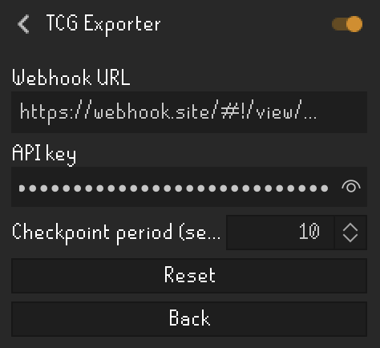

# TCG Exporter

A RuneLite plugin that exports your [osrs-tcg](https://github.com/Azderi/osrs-tcg) card
collection to a webhook URL you configure. Built as a Plugin Hub submission (public,
reviewed by RuneLite's team) rather than a privately-distributed tool, specifically so group
members don't need to run an unsigned standalone executable to keep their collection synced.



## Configuration

Three settings, all in the plugin's config panel:

- **Webhook URL** — the full URL to POST your collection to (e.g.
  `https://your-server.example/api/sync`). Empty by default, which means the plugin does
  nothing at all until you set this — it's opt-in.
- **API key** — sent as the `X-Api-Key` header on every export. Ask whoever runs your
  group's server for this.
- **Checkpoint period (seconds)** — how often to re-check osrs-tcg's actual saved checkpoint
  for the real foil status/pull timestamp (default 30). This is separate from, and slower
  than, the instant live-update path described below.

## What gets sent, and who defines the format

The payload shape is **this plugin's own choice** — it is not dictated by osrs-tcg. osrs-tcg's
own on-disk format (`RLTCG_v2:` + gzip + XOR + base64, see `TcgCollectionDecoder.java`) is just
what this plugin reads *from*; what it sends *to* your webhook is a separate, simple JSON body
this plugin defines itself:

```json
{
  "instances": [
    { "cardName": "Abyssal whip", "foil": true, "acquiredAtEpochMs": 1712345678901 }
  ]
}
```

`acquiredAtEpochMs` is osrs-tcg's own recorded pull timestamp, not the time of the export
request. Point the webhook at whatever backend you like that's willing to accept this shape —
this plugin has no dependency on, or awareness of, any specific server.

Don't have a server yet? [tcg-pool-template](https://github.com/kolox-/tcg-pool-template) is a
barebones, generic self-hostable server + web UI (FastAPI + SQLite + a plain HTML/JS frontend)
built around this exact payload shape — clone it, run `docker compose up`, and point this
plugin's webhook at its `/api/sync` endpoint.

## Data reading: read-only, no compile-time dependency on osrs-tcg

Two complementary paths feed the same webhook, both read-only and with no dependency on the
osrs-tcg plugin at build or run time:

- **Live path** — osrs-tcg exposes a `PluginMessage`-based API (the same one bronzeman-tcg and
  tcg-locked use for their own instant unlocks/pooling) that pushes the complete set of owned
  card *names* the moment your collection changes in memory — no polling, no save/checkpoint
  involved. New names are exported within moments of a pull, but that API folds away foil
  status and pull timestamps, so a brand new card is sent with placeholder values
  (`foil: false`, `acquiredAtEpochMs` = the time it was noticed, not the real pull time).
- **Checkpoint path** — periodically decodes osrs-tcg's actual saved state via RuneLite's own
  `ConfigManager` (`getRSProfileConfiguration("osrstcg", "state")`), independently
  re-implementing osrs-tcg's published encoding (see `TcgCollectionDecoder.java`). This is the
  only source with the real foil/timestamp data, but osrs-tcg only writes it on logout, client
  shutdown, plugin unload, or an explicit save — there's no continuous autosave while playing.

Whichever ran most recently wins for a given card. In practice this means: a pull shows up in
your pool within moments (via the live path) with a best-guess foil/timestamp, then gets
silently corrected to the real values the next time the checkpoint path runs — logout, a
natural save trigger, or `::tcg-save` typed in chat (a public osrs-tcg command, not gated
behind debug mode) if you want it corrected sooner. A backend that treats each sync as a
player's complete current collection (diffing and replacing, not appending — like
[tcg-pool-template](https://github.com/kolox-/tcg-pool-template)'s `/api/sync`) self-heals this
automatically, with no special-casing needed on the server side.

If osrs-tcg's `PluginMessage` API isn't present (an older osrs-tcg build), the live path simply
never fires and everything falls back to the checkpoint path alone — the same behavior this
plugin had before the live path existed.

> **Want accurate foil status and pull timestamps right away, instead of waiting for a natural
> checkpoint?** Run `::tcg-save` in your chat, or just log out — either one forces osrs-tcg to
> checkpoint immediately, which this plugin picks up on its next check and uses to correct any
> placeholder values already sent.

## Plugin Hub compliance notes

This plugin submits data to a third-party server, which the Hub's guidelines require to be:

1. **Opt-in / disabled by default** — satisfied by the webhook URL defaulting to empty; the
   plugin is fully inert until both the webhook and API key are set.
2. **Carry a specific warning** on the relevant config item — the webhook field's `warning`
   is set to the exact required text: *"This feature submits your IP address to a 3rd-party
   server not controlled or verified by RuneLite developers."*

The Hub's rejected-features list also has a broader, separately-worded line — "Plugins which
expose player information over HTTP" — that reads ambiguously enough to warrant real
scrutiny before submitting. In practice, opt-in webhook/API export of *your own* collection
data is an established, already-approved pattern (e.g. [Dink](https://github.com/pajlads/DinkPlugin),
a widely-used Hub plugin built entirely around configurable webhook notifications; osrs-tcg's
own "web album" upload feature). This plugin follows the current template's explicit
opt-in-plus-warning requirement precisely, but final acceptance is a human review decision by
the RuneLite team, not something that can be guaranteed in advance.

## Building and testing it yourself

```
./gradlew build
```

To run it in a development client:

```
./gradlew run
```

If you have a Jagex account, follow [Using Jagex Accounts](https://github.com/runelite/runelite/wiki/Using-Jagex-Accounts)
to log into the dev client. To verify it's working end to end:

1. Set a webhook URL (e.g. `https://webhook.site/...` for a quick manual check) and an API key.
2. Log in with an account that has osrs-tcg installed and some pulled cards.
3. Confirm an initial POST arrives shortly after login (either path may fire first, depending on
   whether osrs-tcg had already checkpointed recently).
4. Pull a new card. Confirm a POST arrives within moments (the live path) with `foil: false` and
   an `acquiredAtEpochMs` close to "now" — that's the placeholder, expected at this point.
5. Run `::tcg-save` in chat. Confirm a follow-up POST arrives with the same card now showing its
   real foil status (if applicable) and the actual pull timestamp — that's the checkpoint path
   correcting the placeholder.

## AI use disclosure

This repository's code and documentation were written by Claude Sonnet 5 (Anthropic), under
human direction and with manual review of all changes.
